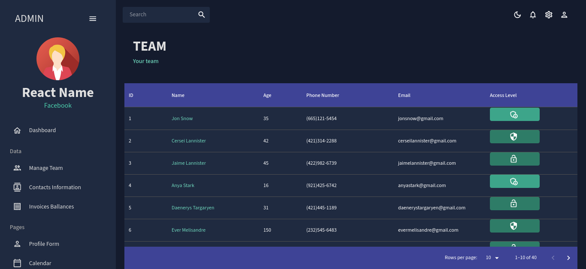
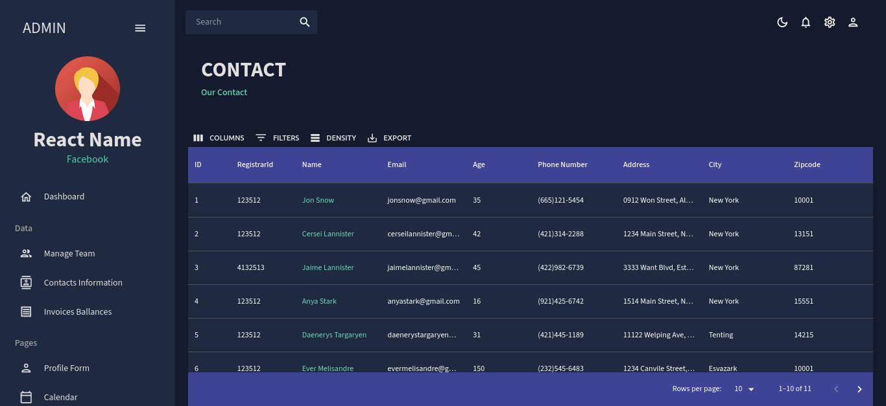
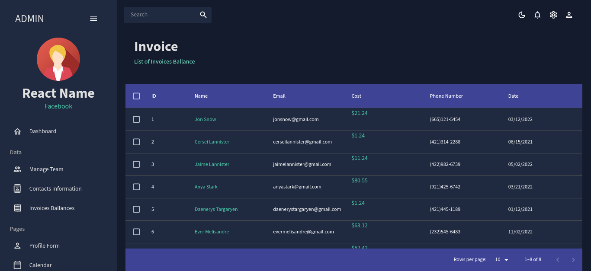
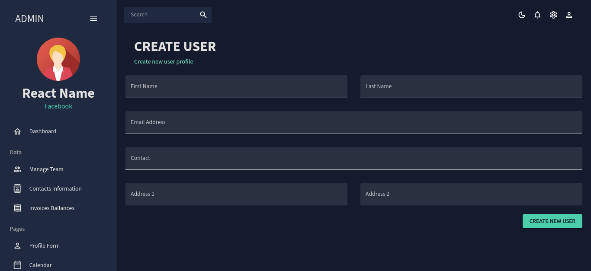
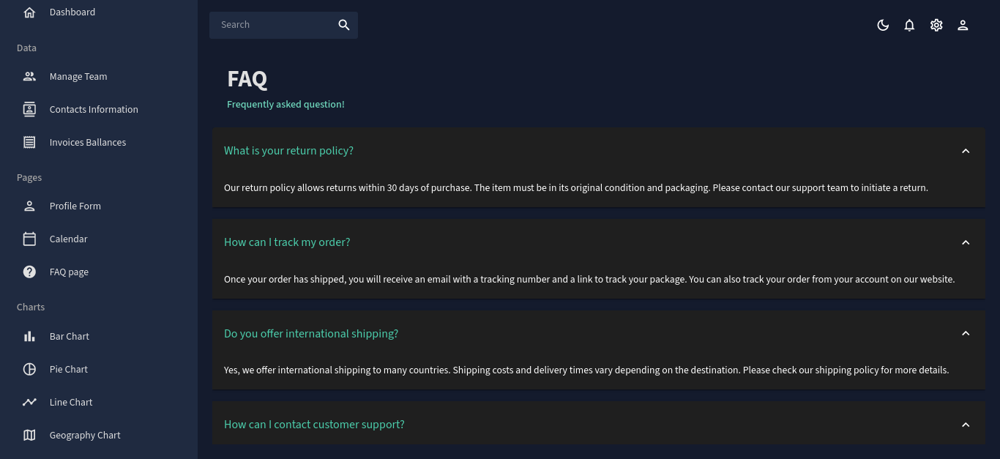
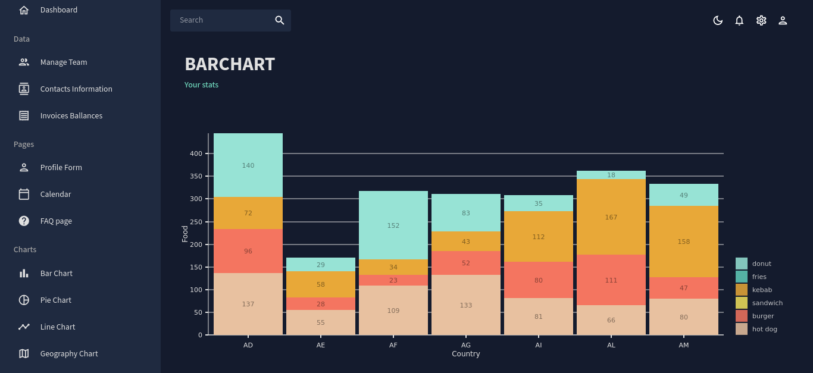
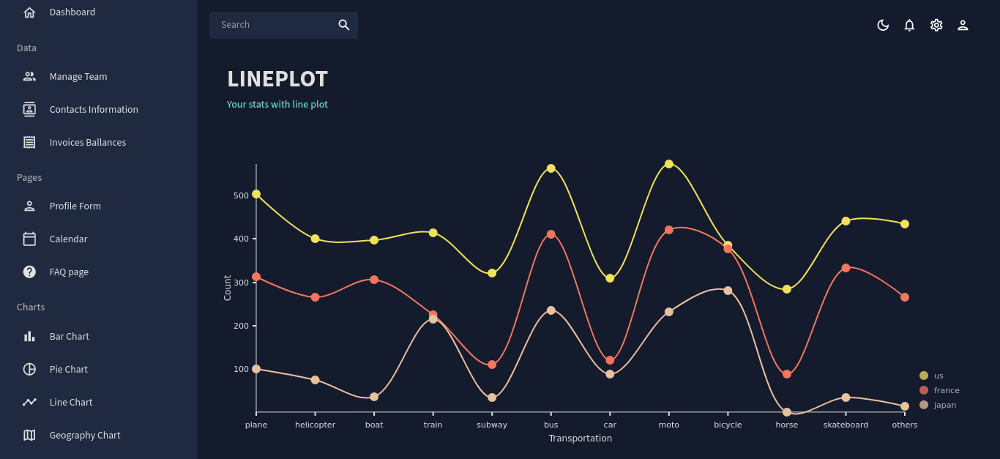

## React admin dashboard

An adaptable and customizable solution suitable for various applications. It features comprehensive user and team management, contact and invoice tracking, an interactive calendar, and multiple data visualization tools. Its versatile design allows it to be easily tailored to meet the administrative needs of any organization or project, ensuring efficient and effective operations.

## ⚙️ Prerequisites

Before you start, ensure you have the following installed:

- **[Node.js](https://nodejs.org/)**: Essential for running the application and managing dependencies.

## 🔧 Installation

### 📂 Clone the Repository

Clone the repository to your local machine:

```bash
git clone https://github.com/iramamy/Admin.git
cd Admin
```

## 📦 Install Dependencies

Install the required npm packages:

```bash
npm install
```

## 🚀 Running the Application

### 🔥 Start the React Application

With the JSON Server running, start the React development server with:

```bash
npm run dev
```

# Preview













# Note:

Yet, this application is not adapted for mobile devices.
